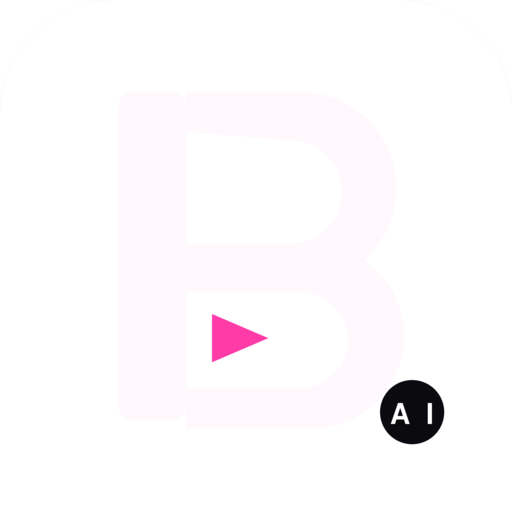

<div align="center">



# BBMW0 Technologies AI

### A mobile-first video editor for Shorts.

Touch UI. 9:16 by default. 10 languages. PWA-installable.
**Multi-LLM AI** with Claude, GPT, Gemini, Perplexity and Llama. Built on Remotion.

<br/>

[](https://vercel.com/new/clone?repository-url=https%3A%2F%2Fgithub.com%2Fbbmw96%2Fbbmw0-technologies-ai&env=ANTHROPIC_API_KEY,OPENAI_API_KEY,GOOGLE_GEMINI_API_KEY,PERPLEXITY_API_KEY,GROQ_API_KEY&envDescription=Optional.%20Add%20any%20one%20to%20enable%20the%20real%20AI%20bar.%20The%20editor%20works%20without%20keys.&envLink=https%3A%2F%2Fgithub.com%2Fbbmw96%2Fbbmw0-technologies-ai%2Fblob%2Fmain%2FDEPLOY.md%23connect-ai-providers)

**☝️ Click to publish your own copy in 90 seconds.** Free. No setup.

[Try it](#try-it) · [AI providers](#ai-providers) · [Install on phone](#install-on-iphone-or-android) · [Languages](#languages) · [Render a Short](#render-a-short) · [Deploy guide](DEPLOY.md) · [Licence](#licence)

</div>

---

## Why it exists

Most video editors were built for the desktop and then squeezed onto phones. BBMW0 Technologies AI starts from the phone instead. Vertical preview is the default, the editor sits one swipe away from playback, exporting to MP4 takes a single tap, the whole interface works in 10 languages with proper right-to-left support, and the AI bar can talk to five different language models at once and merge their answers. It runs on [Remotion](https://remotion.dev), so every frame is real React code that you can fully customise.

## Features

- 9:16 vertical preview. What you see is what gets posted.
- Swipeable scene picker. Hook, Title, Bullets, Quote, CTA. One gesture away.
- Touch-friendly prop editor. Text, colour swatches, sliders. No nested menus.
- Multi-LLM AI bar. Pick a single provider or use consensus mode to ask all of them in parallel and merge the results. Falls back to a smart local heuristic when offline.
- One-tap export to MP4 in Shorts-native 1080×1920.
- PWA-installable. Add to your iPhone or Android home screen, runs full-screen, works offline.
- 10 languages including right-to-left Arabic. Auto-detects from the device locale.
- Five polished scene presets, plus a 60-second Showcase reel, a 60-second Tutorial, three more 60-second Shorts, and a 30-minute long-form explainer.

## Try it

**Hosted (recommended).** Click the Vercel button above. You'll have a public URL in around 90 seconds.

**Locally.**

```bash
git clone https://github.com/bbmw96/bbmw0-technologies-ai
cd bbmw0-technologies-ai
npm install
npm run dev
```

Open the **Network** URL that Vite prints (something like `http://192.168.1.42:5173`) on your phone over the same Wi-Fi, and you'll get the real touch experience.

## AI providers

The AI bar can call any of these. Pick one in the flag pill, or use consensus mode to ask all of them at once.

| Provider | Model | Free tier? | Get a key |
|---|---|---|---|
| 🧠 **Anthropic Claude** | `claude-haiku-4-5` | No (paid only) | https://console.anthropic.com/settings/keys |
| 🤖 **OpenAI GPT** | `gpt-4o-mini` | No (paid only) | https://platform.openai.com/api-keys |
| 💎 **Google Gemini** | `gemini-1.5-flash` | **Yes** | https://aistudio.google.com/apikey |
| 🔎 **Perplexity** | `sonar` | No (paid only) | https://www.perplexity.ai/settings/api |
| 🦙 **Llama via Groq** | `llama-3.3-70b-versatile` | **Yes (generous)** | https://console.groq.com/keys |

Without any keys, the AI bar still works. It falls back to a local heuristic that runs entirely in your browser.

The cheapest way to get real AI is to add `GROQ_API_KEY`. The free tier is generous and that's it, you're sorted.

Why bother with consensus mode? Different models have different strengths. Claude is great at copy. GPT is reliable. Llama on Groq is fast. Gemini handles longer context. Asking all of them in parallel and taking the majority vote per field gives you better results than any single model on its own.

How to add keys to Vercel: see [DEPLOY.md → Connect AI providers](DEPLOY.md#connect-ai-providers).

## Install on iPhone or Android

Once the app is hosted at a public URL:

**iPhone (Safari).**

1. Open the URL in Safari.
2. Tap the Share button.
3. Scroll down, tap "Add to Home Screen", confirm.

**Android (Chrome).**

1. Open the URL in Chrome.
2. Tap the menu (⋮), choose "Install app" or "Add to Home Screen".

The PWA includes a service worker, so once it has been opened, it carries on working offline too.

## Languages

The interface auto-detects from `navigator.language`. Tap the flag pill in the header to switch.

| Code | Language | RTL |
|------|----------|-----|
| `en` | English | |
| `es` | Español | |
| `fr` | Français | |
| `de` | Deutsch | |
| `pt` | Português | |
| `ja` | 日本語 | |
| `zh` | 中文 (简体) | |
| `ar` | العربية | ✓ |
| `hi` | हिन्दी | |
| `ru` | Русский | |

To add a new one, edit `src/i18n.ts`. Every string lives in one place, so a translation is a copy-paste job.

## Render a Short

```bash
npm run render:short        # out/short.mp4         (60s marketing reel)
npm run render:tutorial     # out/tutorial.mp4      (60s explainer)
npm run render:battle       # out/battle.mp4        (60s 5-AI showdown)
npm run render:speedrun     # out/speedrun.mp4      (60s creation timer)
npm run render:featuredrop  # out/featuredrop.mp4   (60s feature montage)
npm run render:longform     # out/longform.mp4      (30-minute long-form)
```

Or render any individual scene:

```bash
npx remotion render src/compositions/registry.tsx Hook out/hook.mp4
```

## Architecture

```
src/
├── App.tsx                    # Mobile-first layout
├── main.tsx                   # React entry, plus service-worker registration
├── styles.css                 # Design system, RTL adjustments, PWA polish
├── i18n.ts                    # 10-language string map
├── state.ts                   # Editor state hook
├── vite-env.d.ts
├── components/
│   ├── SceneCarousel.tsx      # Swipe between scene presets
│   ├── PropEditor.tsx         # Per-scene form
│   ├── ExportModal.tsx        # Download props.json plus render command
│   ├── AIBar.tsx              # Multi-provider AI prompt
│   └── LangSwitcher.tsx       # Flag pill plus dropdown
└── compositions/
    ├── Hook|Title|Bullets|Quote|CTA.tsx
    ├── Showcase.tsx           # 60s marketing reel
    ├── Tutorial.tsx           # 60s explainer
    ├── Battle.tsx             # 60s 5-AI showdown
    ├── SpeedRun.tsx           # 60s creation timer
    ├── FeatureDrop.tsx        # 60s feature montage
    ├── LongForm.tsx           # 30-minute long-form
    └── registry.tsx           # registerRoot for the Remotion CLI

api/
└── ai.ts                      # Vercel serverless 5-provider AI router
                               # (OpenAI, Anthropic, Gemini, Perplexity, Groq)

public/
├── manifest.webmanifest, sw.js, favicon.svg
├── icon-{192,512,maskable}.png, apple-touch-icon.png
└── voiceover-ch{1..9}.mp3     # Long-form chapter audio
```

## Roadmap

- [x] PWA install and offline support.
- [x] 10 languages with RTL.
- [x] Multi-LLM AI bar with five providers and consensus mode.
- [x] Six pre-built compositions (five Shorts plus a 30-minute long-form).
- [ ] In-browser MP4 export via WebCodecs.
- [ ] Server-side render via `@remotion/lambda`.
- [ ] Audio uploads with auto-ducking.
- [ ] Caption auto-sync via `@remotion/captions`.
- [ ] App Store and Play Store wrapper via Capacitor.
- [ ] More languages: id, tr, vi, ko, it, nl, pl, th.

## Tech

- [Remotion 4](https://remotion.dev) for the video framework
- [@remotion/player](https://www.npmjs.com/package/@remotion/player) for in-browser preview
- React 18 with TypeScript 5
- Vite 5 plus a service worker
- Vercel for hosting and the serverless AI router

## Licence

[MIT](./LICENSE). Note that Remotion has a [special licence](https://github.com/remotion-dev/remotion/blob/main/LICENSE.md) which may require a company licence in some commercial cases.

---

<p align="center"><sub>Built mobile-first. For everyone, in any language, anywhere.</sub></p>
